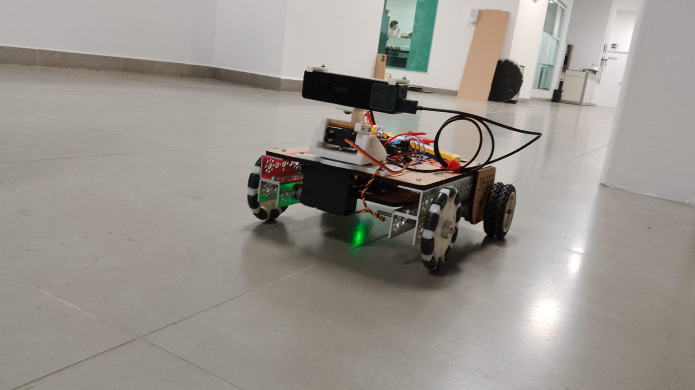
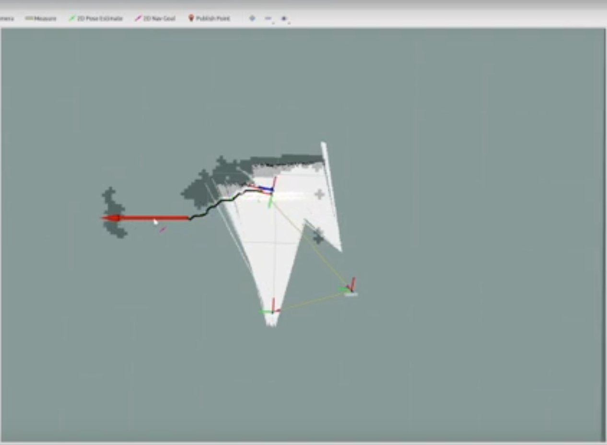
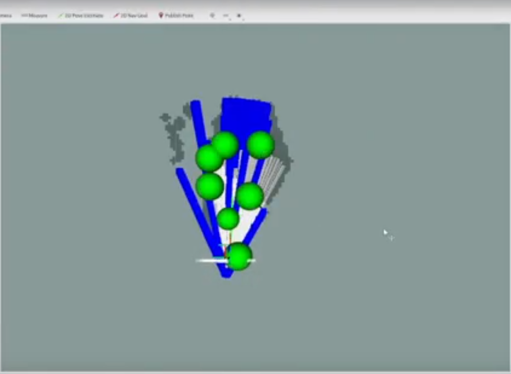

# Rover Autonomous Exploration & Mapping #



Autonomous exploration using ROS navigation stack, gmapping, frontier exploring, Intel Euclid & custom hardware.

## Requirements ##

- Intel Euclid with ROS Kinetic
- ESP32 Devkit V1
- PC with ROS Noetic

## How to use the project ##

Use the catkin_ws as the ros workspace.

``` bash
cd catkin_ws && catkin build
```

Upload the */hardware_interface* into the ESP32 through Platformio.

Launch files Intel Euclid

``` bash
roslaunch rover_odometry rover_odometry

roslaunch depthimage_to_laserscan launchfile_sample.launch
```

Launch files External PC

```
roslaunch rover_slam rover_gmap.launch

roslaunch rover_navigation rover_navigation

roslaunch rover_navigation rover_exploration.launch
```

## Results ##


Autonomous navigation using the ros navigation stack.


Autonomous frontier exploration.
